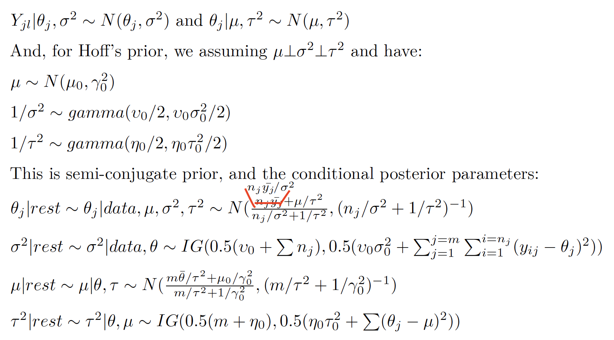

> 学而时习之,不亦乐乎

# Introduction
Computer sampling provides revolutional tools to Bayesian statistics, where posterior distribution is not always directly available. In Bayesian philosophy, a parameter always appears as a distribution, which could be approached by sampling and simulation. In other senarios, we might want to estimate a function of that parameter, or a comaprison between two parameters. Simulations are the only way to get the results in these flexibilities. How to sample a parameter and how to effectively sample are the key I want to address here.

To make writings and understandings easier, I assume there are 2 parameters to be estimated, namely a1 and a2. Y is your current data.

# Sampling and Simulation approaches
More specificly, I will dicuss the following topics, from the easy to hard
* Direct scanning the sample space with a likelihood function
* Monte Carlo
* Markov Chain Monte Carlo
* Metropolis
* Metropolis-Hastings

## Direct sample space scanning
In this approach, scan the sample space of (a1,a2), calculate l(x|a1,a2). Repeat this for N times, and normalize the l(x|a1,a2) to get pdf(a1,a2). With this pdf, you could further calculate p(a1),p(a2), and use Monte Carlo to sample other p(f(a1,a2)) values.

## Monte Carlo
* 1.sample (a1,a2) from pdf(a1,a2)
* 2.compute f(a1,a2) <span style="background-color: #FFFF00"> <b> Note: for predictive distributions,sample another time x ~ p(x\|a1,a2), and let f(a1,a2) = x to fit this frame. In this case, all f(a1,a2) are iid </b> </span>
* 3.repeat 1 and 2 to get f1(a1,a2),f2(a1,a2),...
* 4.compute mean(f),sd(f),g(f) from samples in 3.

## Markov Chain
P(x(s+1)|x(0),x(1),...x(s)) = P(x(s+1)|x(s)) for any s, then X(0...) are Markov Chain

Some key concepts:
>>1. <b>Irreducible</b> chain:  it is possible to reach any state from any other state (not necessarily in a single time step)
>>2. <b> Aperiodic</b> chain: A state has period k if, when leaving it, any return to that state requires a multiple of k time steps (k is the greatest common divisor of all the possible return path length). If k==1 for all state, then the chain is aperiodic.  For an irreducible Markov chain, if one state is aperiodic then all states are aperiodic [Easy to proof by contradiction].
>>3. <b>recurrent</b>: A state is transient if, when we leave this state, there is a non-zero probability that we will never return to it. Conversely, a state is recurrent if we know that we will return to that state, in the future, with probability 1 after leaving it (if it is not transient). For a <b>recurrent</b> state,  the <b>expected return time</b> is defined as the mean recurrence time when leaving the state: positive recurrent state (finite expected return time) and null recurrent state (infinite expected return time).
>>4. <span style="background-color: #FFFF00"><b>Ergodic Theorem</b></span>: If {x(1), x(2), . . .} is an irreducible, aperiodic and recurrent Markov chain, then there is a unique probability distribution (<b> stationary distribution of the Markov chain</b>) such that s--> \infty:
>>  a. P(x(s))-->pi(x);
>>  b. (sum{g(x(1....s))})/s -->E[g(x(s))]
>>5. A standard empirical method to assess convergence is to run several independent simulated Markov chains and check that the ratio of inter-chain to intra-chain variances for all the parameters sampled is close to 1

The Markov Chain Property above provide theoretical grantee that MCMC could achieve stationary, and we could approach the related parameters using MCMC simulations.
## Markov Chain Monte Carlo
In some cases, we could only get p(a1|a2) and p(a2|a1), but not p(a1,a2). Then, we could apply Gibbs sampler.
Some new terms:
>Semiconjugate prior/conditional conjugate
>> p(a1\|a2,y) and P(a1\|a2) belong to the same distribution family

>Gibbs sampler
>>1. sample a1(s+1) ~ p(a1\|a2(s),Y) 
>>2. sample a2(s+1) ~ p(a2\|a1(s+1),Y)
>>3. let aa(s+1) = (a1(s+1),a2(s+1)) be your (s+1)th sample

>>Gibbs sampler generates a dependent sequence of [aa(1),aa(2),...]. However, aa(s) is conditionally independent of aa(1),...aa(s-2) given aa(s-1)

>>This is Markov Property, and the sequence is Markov Chain.


* The sampling process is as shown in Gibbs sampler above

### R example of MCMC

The back ground is you have 100 schools, and the mathscores of the students in each school. The task is to rank the schools based on the average math performance of each school.



```r
#Data set file: Y.mathscore.txt
#In YY has two columns, school, and mathscore
#The task is to rank schools based on the mathscores, either average or median
source(file="Y.mathscore.txt")
head(YY)
## school mathscore
## [1,] 1 52.11
## [2,] 1 57.65
## [3,] 1 66.44
## [4,] 1 44.68
## [5,] 1 40.57
ids <- unique(YY[,1]) # school IDS
Y <- list() # scores to go in a list, by school
J <- length(ids) # compute summaries by school
n<-ybar <-ymed <-s2 <- rep(0,J) #n,length; ybar,mean;s2,var
for(j in 1:J) {
  Y[[j]] <- YY[YY[,1]==ids[j],2]
  ybar[j] <- mean( Y[[j]] )
  ymed[j] <- median( Y[[j]] )
  n[j] <- length( Y[[j]] )
  s2[j] <- var( Y[[j]] )
}
# Plot data, schools ordered by mean. First plot is null, just sets up axes
{
  par(mfrow=c(1,1))
  plot(c(1,J),range(Y) ,type="n",ylab="math score",
  xlab="rank of school-specific math score average")
  for(l in 1:J) {
  j <- order(ybar)[l]
    points( rep(l,n[j]), Y[[j]],pch=16,cex=.6 )
    segments( l,min( Y[[j]] ),l,max( Y[[j]]) )
  }
  abline(h=mean(ybar))
  title(main="Math Scores with Schools Ordered by Average Score")
}

# MCMC simulations
# Weakly informative priors, Hoff's Prior
nu0 <- 1 ; s20 <- 100 # for sigma^2
eta0 <- 1 ; t20 <- 100 # for tau^2
mu0 <- 50 ; g20 <- 25; # for mu
# Gibbs starting values
m <- length(Y)
n <-sv <-ybar <-rep(NA,m)
for(j in 1:m) {
  ybar[j] <- mean( Y[[j]] )
  sv[j] <- var( Y[[j]] )
  n[j] <- length( Y[[j]] )
}
theta <- ybar # school means as start for theta
sigma2 <- mean(sv) # average of within school variances for sigma^2
mu <- mean(theta) # mean school mean as start for mu
tau2 <- var(theta) # variance of school means as start for tau^2
# Setup MCMC
set.seed(1)
S <- 5000
THETA <- matrix( nrow=S,ncol=m) # contains thetas (m of them)
MST <- matrix( nrow=S,ncol=3) # contains mu, tau^2, sigma^2
RANK <- matrix(nrow=S,ncol=m)
# MCMC algorithm
for(s in 1:S){
  # Sample new thetas
  for(j in 1:m)
  {
    vtheta <- 1/( n[j]/sigma2+1/tau2 )
    etheta <- vtheta*( ybar[j]*n[j]/sigma2+mu/tau2 )
    theta[j] <- rnorm(1,etheta,sqrt(vtheta))
  }

  # sample new sigma^2
  nun <- nu0+sum(n);
  ss <- nu0*s20;
  for(j in 1:m){ ss <- ss+sum( ( Y[[j]]-theta[j] )^2 ) }
  sigma2 <- 1/rgamma(1,nun/2,ss/2)
  # sample new mu
  vmu <- 1/( m/tau2+1/g20 )
  emu <- vmu*( m*mean(theta)/tau2 + mu0/g20 )
  mu <- rnorm(1,emu,sqrt(vmu))
  # sample new tau^2
  etam <- eta0+m
  ss <- eta0*t20 + sum( (theta-mu)^2 )
  tau2 <- 1/rgamma(1,etam/2,ss/2)
  # store results
  THETA[s,] <- theta
  MST[s,] <- c(mu,sigma2,tau2)
}
#update RANK for each iteraction
for(s in 1:S){
  current_rank <- order(THETA[s,],decreasing = F)
  for(i in 1:m){
    RANK[s,current_rank[i]] = i
  }
}
# Trace plots provided for parameters ( i.e. excludes thetas )
stationarity.plot<-function(x,...){
  S <-length(x)
  scan <-1:S
  ng <-min( round(S/100),10)
  group <-S*ceiling( ng*scan/S) /ng
  boxplot(x~group,...)
}
{
  par(mfrow=c(2,2))
  stationarity.plot(MST[,1],xlab="iteration",ylab=expression(mu),main="MCMC Batches")
  stationarity.plot(MST[,2],xlab="iteration",ylab=expression(sigma^2),main="MCMC Batches")
  stationarity.plot(MST[,3],xlab="iteration",ylab=expression(tau^2),main="MCMC Batches")
}

# MCMC summaries for parameters
# Access the MCMC quality
library(coda)
{
  par(mfrow=c(2,2), oma=c(0,0,0,0),mar=c(0,0,2,2),mai = c(0.51, 0.51, 0.51, 0.51))
  acf(MST[,1],main=expression(paste("ACF for ",mu)))
  acf(MST[,2],main=expression(paste("ACF for ",sigma^2)))
  acf(MST[,3],main=expression(paste("ACF for ",tau^2)))
  title(main="Autocorrelation Functions",line=-1,outer=TRUE)
}
MST_mc <- as.mcmc(MST)
summary(MST_mc)
effectiveSize(MST)
# Density plots with superimposed posterior interval
{
  par(mfrow=c(2,2))
  plot(density(MST[,1],adj=2),xlab=expression(mu),main="",lwd=2,
  ylab=expression(paste(italic("p("),mu,"|",italic(y[1]),"...",italic(y[m]),")")))
  abline( v=quantile(MST[,1],c(.025,.5,.975)),col="gray",lty=c(3,2,3) )
  plot(density(MST[,2],adj=2),xlab=expression(sigma^2),main="", lwd=2,
  ylab=expression(paste(italic("p("),sigma^2,"|",italic(y[1]),"...",italic(y[m]),")")))
  abline( v=quantile(MST[,2],c(.025,.5,.975)),col="gray",lty=c(3,2,3) )
  plot(density(MST[,3],adj=2),xlab=expression(tau^2),main="",lwd=2,
  ylab=expression(paste(italic("p("),tau^2,"|",italic(y[1]),"...",italic(y[m]),")")))
  abline( v=quantile(MST[,3],c(.025,.5,.975)),col="gray",lty=c(3,2,3) )
  title(main="Estimated Posterior Densities with 95% Interval",line=-1,outer=TRUE)
}
# Print the RANKs
theta.hat <- apply(THETA,2,mean)
RANK_mc <- as.mcmc(RANK)
RANK_mc_summary <- summary(RANK_mc)
theta_mc_summary <- summary(as.mcmc(THETA))
df_rank <- data.frame(school=c(1:m),
rank_mean=RANK_mc_summary$statistics[,"Mean"],
rank_SD=RANK_mc_summary$statistics[,"SD"],
rank_2.5=RANK_mc_summary$quantiles[,1],
rank_97.5=RANK_mc_summary$quantiles[,5],
theta_mean=theta.hat,
theta_SD = theta_mc_summary$statistics[,"SD"])
df_rank <- df_rank[order(df_rank$rank_mean,decreasing = F),]
rownames(df_rank) <- NULL
df_rank$rank <- 1:m
plot(rank ~ theta_mean,data=df_rank,
  xlab="Bayesian mean",ylab="Bayes rank",
  main="Bayes rank Vs the posterior mean")

{
  par(mfrow=c(1,1))
  #plot(c(1,J),range(Y) ,type="n",ylab="math score",xlab="rank of school-specific math score average")
  plot(rank_mean ~ rank,data=df_rank,xlab="Bayes rank",ylab="Posterior mean of rank")
  for(l in 1:m) {
  points( rep(l,2), c(df_rank[l,4],df_rank[l,5]),pch=16,cex=.6 )
  segments( l,df_rank[l,4],l,df_rank[l,5] )
  }
  title(main="Posterior rank mean(with 95% CI) Vs Bayes rank")
}
```
## Metropolis
If the conjugate or semiconjugate prior is not available, we could apply Metropolis-Hastings algorithm as a general method. Let's start with Metropolis:
Assuming you have aa(s) in the chain, then you want sample aa(s+1):
* 1. Sample aa(*) ~ J(aa\|aa(s)), where J(aa\|aa(s)) is any symmetric proposal distribution.
* 2. Compute the acceptance ratio: r = p(aa(\*)\|y)/p(aa(s)\|y) = {p(y\|aa(\*)) p(aa(\*))}/{p(y\|aa(s)) p(aa(s))}
* 3. Sample u ~ Unif(0,1); aa(s+1) = ifelse(r>u,aa(\*),aa(s))
  
From the above algorithm, aa(s+1) is only depending on aa(s). So the Metropolis algorithm generates a Markov Chain. 

To improve the performance of the Markov chain, we need to choose J distribution properly. Most of the time, we could choose J as a U[aa(s)-delta,aa(s)+delta]. Then, choose a reasonable "delta" could improve your MCMC sampling. You could choose delta = SD[aa] to start.

Comparing to the most simple grid sampling, the Metropolis algorithm helps to largely increase the sampling effeciency by restricting the newly sampled parameters to be the proposal distribution. If the proposal distribution is too wide and flat(delta is big, here), then it would be similar to grid sampling: low effeciency with a lot of rejections (low probability). In this case, you will get low ACR. Because of low ACR,you will have large chance aa(s+1) = aa(s), thus high ACF. 

On the other hand, if the proposal function is too narrow, this means that you are sampling in a really small “grid” around aa(s) at each step, then you will have a high ACF because aa(\*) is too close to aa(s). At the same time, you will have high ACR because your new sampled value will be more likely to be effective[if r>=1, accept; if r<1, then you have Pro= r probility to accept. because aa(\*) is really close to aa(s), r should be really close to 1]. Meanwhile, it will take longer to get stationary if the starting point is too far away.

If there are multiple parameters, we could:
1. update a1(s+1) based on p(a1(\*),a2(s)\|y)/p(a1(s),a2(s)\|y)
2. update a2(s+1) based on p(a1(s+1),a2(\*)\|y)/p(a1(s+1),a2(s)\|y)

### R examples of Metropolis
```r

#For the Metropolis algorithm, we need to specify 3 things:

#1.the prior distribution for the parameters, here it is $\theta \sim Gamma(1,52)$

#2.the hypothesized data distribution given the parameters. Here it is $Exp(\theta)$

#3.the proposal symetric distribution to get theta*, here it is $U(\theta_i-\delta; \theta_i+\delta)$

#Metropolis for Exp model
## y is the survival times in weeks for 17 leukemia patients
y <- c(65, 156, 100, 134, 16, 108, 121, 4, 39, 143, 56, 26, 22, 1, 1, 5, 65)
#the typical survival time for patients given a similar treatment was 1 year (52 weeks).
#assumed that the individual survival times followed an exponential distribution,  for which a reasonably non-informative prior is theta ~ Gamma(1, 52).
#theta_prior ~ Gamma(1,52)
alpha_prior=1
beta_prior=52

#Note, based on the current assumption, we could get posterior theta directionly:
#theta_post ~ Gamma(1+17,52+sum(y)) = Gamma(18,1114). But here, I want to use Metropolis sampling method as a demo
#par(mfrow=c(3,2))
ACR  <- ACF <- EffectSampleSize <- NULL
THETAA <- NULL
delta2 <- 0.1
delta2_testSet <- c(0.005+0.001*c(1:30))
for(delta2 in delta2_testSet)  {

   set.seed(1)
   THETA  <- NULL
   theta     <- 0.0001          # initial theta

   acs   <- 0              # tracks number of proposal acceptances
   S      <- 10000      # iterations 

   for(s in 1:S) {

      theta.star <- runif(1,theta-delta2,theta+delta2)
      #
      if(theta.star > 0 ){ #Only process when theta.start >0
        log.al       <- sum( dexp(y,rate=theta.star,log=TRUE) -
                                   dexp(y,rate=theta,log=TRUE)  )  +
                                   dgamma(theta.star,shape=alpha_prior,rate=beta_prior,log=TRUE) -        
                                   dgamma(theta,shape=alpha_prior,rate=beta_prior,log=TRUE) 

        if( log(runif(1)) < log.al ){ theta<-theta.star; acs<-acs+1 }
      }
       THETA <- c(THETA,theta)  
    }

       ACR        <- c(ACR,acs/s) 
       ACF         <- c(ACF,acf(THETA,plot=FALSE)$acf[2])
       EffectSampleSize <- c(EffectSampleSize,effectiveSize(as.mcmc(THETA)))
       #THETAA  <- cbind(THETAA,THETA)
}

{
  par(mfrow=c(1,2))
  plot(y=EffectSampleSize,x=delta2_testSet,xlab="Delta")
  plot(y=ACR,x=ACF)
}

data.frame(Delta =delta2_testSet,ACR,ACF,EffectSampleSize)
```

## Metropolis-Hastings algorithm
Similar to Metropolis algorithm, change J(aa|aa(s)) to any distribution,and modify the acceptance ratio accordingly:
* 1. Sample aa(*) ~ J(aa\|aa(s)), where J(aa\|aa(s)) is any proposal distribution.
* 2. Compute the acceptance ratio: r = p(aa(\*)\|y)/p(aa(s)\|y) * J(aa(s)\|aa(\*))/J(aa(\*)\|aa(s)) 
* 3. Sample u ~ Unif(0,1) and set aa(s+1) = ifelse(r>u,aa(\*),aa(s))


---
