

>Multi-Agent Minds, One Mission.

# Kaggle Notebook
The Kaggle Notebook for this blogpost (including code implementations and demos) could be found at:

{{note}} [Kaggle Notebook for Supply Chain Acharya: A GenAI-Powered Digital Twin](<a href="https://www.kaggle.com/code/toshall/agentic-supply-chain-acharya" target="_blank" rel="noopener noreferrer">
  https://www.kaggle.com/code/toshall/agentic-supply-chain-acharya
</a>) {{end}}

# Problem Overview: Why Are the Shelves Empty—or Overflowing?
Imagine walking into your local store looking for eggs, only to find the shelves bare. Or picture a store associate asking, "Why are we getting so many eggs we can’t sell?" These everyday questions reflect a deeper issue in the retail supply chain: inventory mismanagement. Whether it’s understocking that disappoints customers or overstocking that drives up waste and cost, the underlying problem is surprisingly complex.

These problems are not just operational—they’re strategic and systemic. From decisions about the physical supply network to individual item parameters affecting availability, the supply chain is governed by a vast, interdependent set of rules.

# Our Solution: Supply Chain Acharya
To tackle this challenge, our team developed Supply Chain Acharya, a GenAI-powered assistant built on top of a Digital Twin of a simplified retail supply chain. 

With this assistant, we could just tell it what we want, and it would:

- Understand our problem.
- Search across multiple databases store inventory,orders,forecast,sales, logistic lead times.
- Analyze and Root-cause and Recommend the best possible solution/next steps.
- Show results in a structured format like JSON or table

# Method
Supply Chain Acharya is a Gen AI-powered assistant designed to uncover these root causes dynamically helping the store managers, replenishment planners rootcause and recommend on next steps. The functionality has been tested with the information using a Digital Twin of a retail supply chain network.

## Digital Twin of a retail supply chain network

We created a 30-day simulation of demand and replenishment for a small but representative network:
•	2 Distribution Centers (DCs)
•	10 Suppliers
•	30 Stores
•	20 Items (2 per supplier in each store)
•	Simulated lead times between vendors, DCs, and stores
•	Calendar-based logic for shipping and receiving 

This setup allows us to inject disturbances, model replenishment strategies, and understand the downstream effects of seemingly small parameter changes.

Details of the supply chain network could be viewed below

```mermaid
graph TD;
    SP1-->DC1;
    SP2-->DC1;
    SP3-->DC1;
    SP4-->DC1;
    SP5-->DC1;
    SP6-->DC1;
    SP7-->DC1;
    SP8-->DC1;
    SP9-->DC1;
    SP10-->DC1;
    SP1-->DC2;
    SP2-->DC2;
    SP3-->DC2;
    SP4-->DC2;
    SP5-->DC2;
    SP6-->DC2;
    SP7-->DC2;
    SP8-->DC2;
    SP9-->DC2;
    SP10-->DC2;
    DC1-->ST1;
    DC1-->ST2;
    DC1-->ST3;
    DC1-->ST4;
    DC1-->ST5;
    DC1-->ST6;
    DC1-->ST7;
    DC1-->ST8;
    DC1-->ST9;
    DC1-->ST10;
    DC1-->ST11;
    DC1-->ST12;
    DC1-->ST13;
    DC1-->ST14;
    DC1-->ST15;
    DC2-->ST16;
    DC2-->ST17;
    DC2-->ST18;
    DC2-->ST19;
    DC2-->ST20;
    DC2-->ST21;
    DC2-->ST22;
    DC2-->ST23;
    DC2-->ST24;
    DC2-->ST25;
    DC2-->ST26;
    DC2-->ST27;
    DC2-->ST28;
    DC2-->ST29;
    DC2-->ST30;
```

## Tech Stack
•	Python for simulation and logic
•	SQLite for structured data management
•	Pandas for data analysis
•	GenAI (ChatGPT) as the question-answering interface
•	Visualizations using Matplotlib/Plotly for insights

## What Can Supply Chain Acharya Do?
•	Answer questions like: "Why did this item stock out on Day 10?"
•	Trace inventory flows across the supply chain
•	Help diagnose root causes like incorrect lead times or missed order windows
•	Explain the logic behind replenishment quantities and forecast mismatches

## Why It Matters
This proof-of-concept lays the groundwork for:
•	Scalable decision support tools for large retailers
•	Explainable AI in operational environments
•	Improved training for replenishment analysts
•	Faster diagnosis of recurring inventory issues

---
